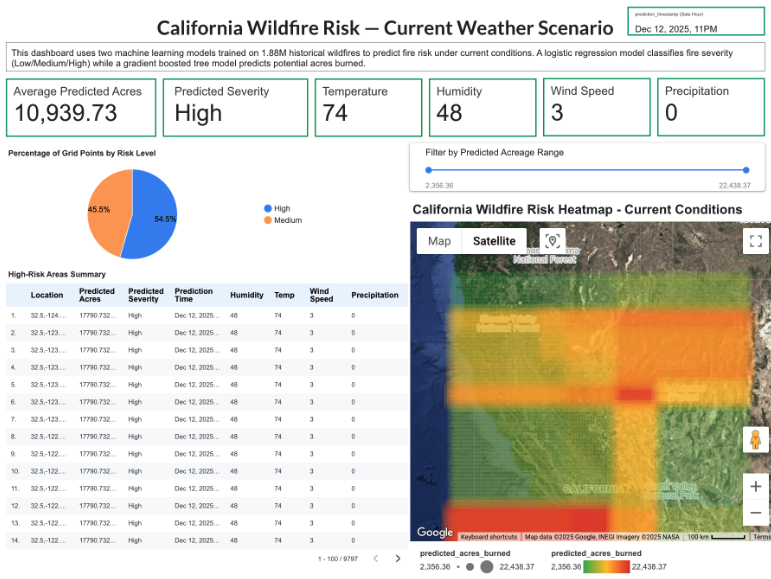

# Wildfire Alert System

A cloud data pipeline that combines 24 years of historical wildfire records with live weather data to predict fire severity and potential acreage burned under current conditions, built on a Lambda architecture in Google Cloud.

## Overview

The system answers a specific operational question: given current wind, temperature, and humidity, how severe would a fire be if one started right now. Three layers work together:

- **Batch layer.** 1.88 million historical U.S. wildfire records (1992-2015, Kaggle) are loaded into Cloud Storage and then BigQuery, forming the training data for both models.
- **Speed layer.** Live weather conditions are pulled from the Open-Meteo API on a schedule (Cloud Scheduler), published to Pub/Sub by a Cloud Function, and streamed into BigQuery. The current implementation scopes this feed to a single reference point (Los Angeles) as a proof of concept for the ingestion pipeline; production use would extend it to pull per-region readings across the prediction grid.
- **Analytics layer.** Two BigQuery ML models run on the combined data: a regression model estimating acres burned, and a classification model assigning a severity category. Predictions are generated across a grid of coordinates spanning California and visualized on a Looker Studio dashboard.

## Key Findings

- **The linear regression baseline failed, and that failure is documented rather than hidden.** A first-pass linear regression predicting acres burned (`FIRE_SIZE`) produced an R2 of just 0.08, MAE of 4,046 acres, and RMSE of 15,766 acres, explaining almost none of the variance in fire size.
- **Switching to a Boosted Tree Regressor, with feature engineering, cut error by more than half.** Capping the target at its 99th percentile to limit outlier influence and adding engineered features (a temperature-humidity interaction term, a custom fire danger index, and two geographic features capturing latitude and coastal proximity) brought MAE down to 1,603.94 acres and RMSE to 4,856.73, with R2 improving to 0.34, a fourfold gain over the linear baseline.
- **The classification model reaches strong overall accuracy but weaker precision on individual severity classes.** A logistic regression classifying fire severity (Low: ≤1,000 acres, Medium: 1,001-10,000 acres, High: >10,000 acres) achieved 89.7% accuracy and a ROC AUC of 0.865, but precision (0.578), recall (0.405), and F1 (0.426) were considerably lower, meaning the model is better at overall discrimination than at reliably catching every high-severity event, a meaningful limitation for an alert system where missed high-severity fires carry the most operational risk.
- **The streaming pipeline closes the loop end to end.** Live weather data flows from the Open-Meteo API through a Cloud Function, Pub/Sub, and a Dataflow job into BigQuery, where it is combined with a generated grid of California coordinates and scored by both models to produce a continuously updated risk surface across the state.

## Limitations

1. The regression model's R2 of 0.34 means the majority of variance in fire size remains unexplained; predicted acreage should be read as a directional estimate, not a precise forecast.
2. The classification model's precision and recall on the Medium and High severity classes are meaningfully lower than its headline accuracy, an accuracy figure driven largely by the more common Low-severity class.
3. Historical training data spans 1992-2015 and is not reweighted for recent climate trends, and the dataset's regional coverage (concentrated in California and other historically fire-prone states) can bias predictions for underrepresented areas.
4. No automated monitoring or retraining is in place; both models would need a periodic retraining cadence in production to avoid drift.

## Next Steps

The streaming layer currently ingests weather for a single reference point (Los Angeles) to prove out the Cloud Function → Pub/Sub → BigQuery pipeline end to end. Extending it to poll each region in the prediction grid (or a representative set of weather stations across California) would let the heatmap reflect real spatial variation in conditions rather than one shared reading, and is the most direct next step toward a production-ready version.

## Dashboard

A screenshot of the deployed dashboard, showing predicted severity and acreage burned across a California-wide grid under a live weather scenario, is included below.

## Tech Stack

Google Cloud (Cloud Storage, BigQuery, BigQuery ML, Pub/Sub, Cloud Functions, Cloud Scheduler, Dataflow) · Looker Studio · Open-Meteo API · Python (pandas, NumPy, matplotlib, seaborn) · Google Colab

## Repository Contents

- `wildfire_alert_system.ipynb`: full pipeline (batch ingestion, both ML models with the linear-to-boosted-tree progression, real-time streaming infrastructure, and grid-based prediction generation for the dashboard)
- `README.md`: this file
- `dashboard_screenshot.png`: screenshot of the Looker Studio dashboard, included since the live link is no longer active

## Team

Group project with Gabriel Wang and Xinyi Zhang.
